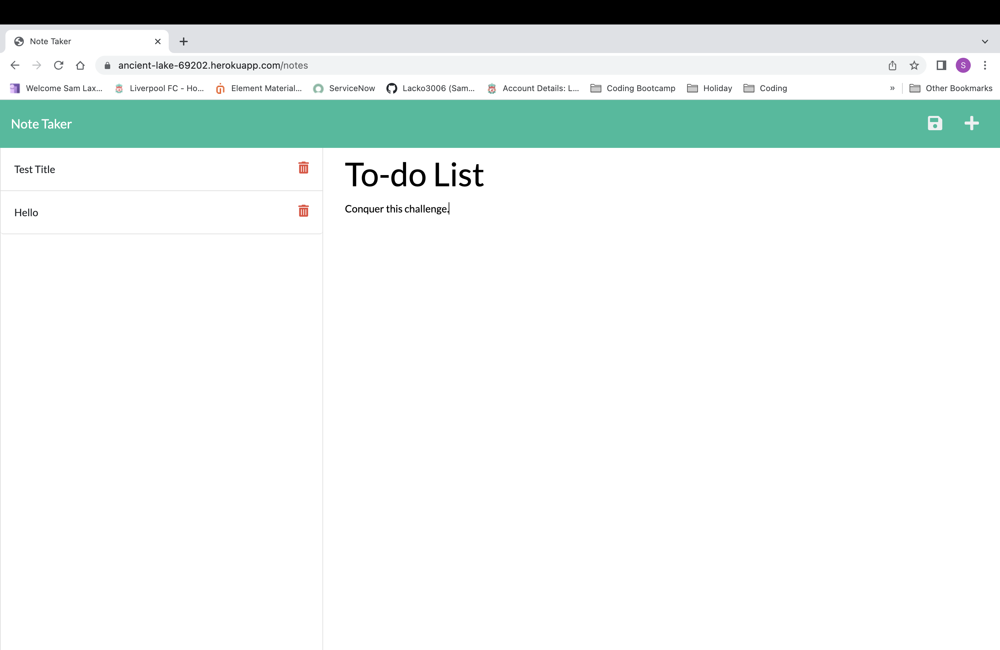
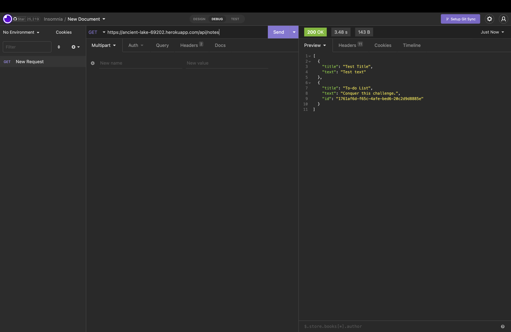

# 11 Express.js: Note Taker

## Description

This web application is a note taker using HTML, CSS, JavaScript, node.js & express.js. You are presented with a homepage, when pressing the button at the center of the page you are taken to the note taker page. This page allows you to type in a note and save it to the front end and back end.

This application has been created to demonstrate my skills in connecting the front end to the back end using express.js & node.js.This project was built to showcase my abilities within the backend using node.js & express.js. The note becomes saved into the backend 

## Mock Up - Notes Page

## Mock Up - Saved note as JSON in Backend

## Link
https://ancient-lake-69202.herokuapp.com/